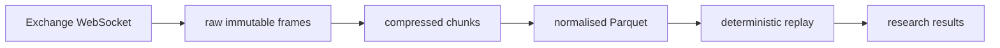

# Astral Project

**An open, reproducible measurement layer for crypto markets.**

Astra makes it possible to determine whether a trading idea actually survives
fees, slippage, latency, liquidity and realistic fills — and to reproduce that
determination later.

Historical research and simulation only. No execution, no trading, no capital.
A rigorous "this has no edge" is a successful result here.

## Status

- **Done** — core types, chunked capture store with SHA-256 integrity index,
  `astra-record init`, `astra-record capture` verified against the live Binance
  book-diff feed, reconnect with explicit gap records.
- **Working on** — venue update-ID continuity checking, a second venue,
  additional channels.
- **Next (one thing)** — rebuild L2 order books from captured data and validate
  them against exchange-published checksums.

## What exists today

| Component | State |
| --- | --- |
| Workspace, build, tests, lint | DONE |
| `Fixed` fixed-point decimal | DONE |
| `Timestamp` nanosecond clock value | DONE |
| Venue, market type, symbol, channel identifiers | DONE |
| `CaptureRecord`, `CaptureManifest`, `CaptureFlags`, `GapMarker` | DONE |
| `astra-record init` capture layout | DONE |
| Chunked record store with SHA-256 integrity index | DONE |
| Live Binance capture, `book_diff` channel | DONE |
| Reconnect with explicit gap records | DONE |
| Bybit feed | NOT IMPLEMENTED |
| Channels other than `book_diff` | NOT IMPLEMENTED |
| Venue update-ID continuity checking | NOT IMPLEMENTED |
| Order-book reconstruction | NOT IMPLEMENTED |
| Exchange checksum validation | NOT IMPLEMENTED |
| Normalised Parquet datasets | NOT IMPLEMENTED |
| Deterministic replay | NOT IMPLEMENTED |
| Cost and execution model | NOT IMPLEMENTED |

Nothing above is a stub dressed up as finished. The gaps are the roadmap.

## Data flow



| Stage | State |
| --- | --- |
| Exchange WebSocket | PARTIALLY IMPLEMENTED |
| Raw immutable frames | PARTIALLY IMPLEMENTED |
| Compressed chunks | DONE |
| Normalised Parquet | NOT IMPLEMENTED |
| Deterministic replay | NOT IMPLEMENTED |
| Research results | NOT IMPLEMENTED |

Partially implemented means one venue and one channel. Binance `book_diff` is
connected and verified; Bybit and every other channel are not connected yet.

## Repository layout

| Path | Purpose |
| --- | --- |
| `crates/astra-types` | The schema: decimal and timestamp primitives, identifiers, capture records |
| `crates/astra-record` | Lossless market-data capture |
| `ROADMAP.md` | Gates with measurable definitions of done |

## Data model

| Type | Representation | Rule |
| --- | --- | --- |
| `Fixed` | `i128` scaled by 10^8 | decimal strings in, canonical eight places out; more than eight places is rejected rather than silently rounded; arithmetic rounds half away from zero |
| `Timestamp` | `i64` nanoseconds since epoch | ordered, serialised as raw nanoseconds |
| `Symbol` | validated `BASE/QUOTE` | uppercase ASCII alphanumeric with `.`, `_`, `-` |
| `Venue` | `binance`, `bybit` | parsed case-insensitively, stored canonically |
| `MarketType` | `spot`, `perp_usdt` | |
| `Channel` | `book_diff`, `book_snapshot`, `trade`, `book_ticker`, `funding`, `open_interest`, `liquidation` | |

Floating point is for derived analytics only, through
`to_f64_for_analytics`. Prices, quantities, fees and PnL never touch it.

## Capture records

| Field | Meaning |
| --- | --- |
| `seq` | position in the capture stream |
| `instrument` | venue + market type + symbol |
| `channel` | kind of market data |
| `ts_socket` | when the frame was read locally |
| `ts_exchange` | timestamp supplied by the venue, when present |
| `payload` | raw bytes, untouched |
| `flags` | capture quality bits |

| Flag | Meaning |
| --- | --- |
| `SEQUENCE_GAP` | the venue stream skipped a sequence number |
| `DUPLICATE` | the frame repeats one already recorded |
| `RESYNC` | the capture resynchronised after a gap |
| `STALE` | the data was too old to trust at capture time |
| `UNRELIABLE` | the surrounding window cannot be trusted |
| `TRUNCATED` | the payload was cut short |
| `SYNTHETIC` | the record was written by the recorder, not by the venue |

## Gap records

When a feed drops and is re-established, the recorder writes one synthetic
record into the stream rather than letting the hole go unnoticed. It carries
`SYNTHETIC | SEQUENCE_GAP | UNRELIABLE` and a JSON payload:

```json
{ "started_at": 1790420019514000000,
  "ended_at": 1790420021770000000,
  "attempts": 1,
  "reason": "venue_close" }
```

A reader that filters out `SYNTHETIC` records sees only venue data; a reader
that does not will find the gap explicitly marked instead of silently
absorbing it. `frames_written` in the manifest counts venue frames only.

## Capture layout

```text
capture/
├── manifest.json
└── frames/
    ├── index.json
    ├── chunk-000000.zst
    ├── chunk-000001.zst
    └── ...
```

`manifest.json` records the schema version, a generated capture id, the
creation time, the instrument, the channel, the number of frames written and
the reason capture stopped. A capture that ended because the venue dropped the
connection says so; it never looks like a clean finish.

`index.json` records, for every chunk: its name, the first and last sequence
number it holds, the record count, the byte size and the SHA-256 of the
compressed file. Reading a capture verifies every chunk against that hash
before decoding it, so silent corruption is detected rather than absorbed.

## Chunk format

A chunk is a zstd-compressed stream of length-prefixed records: a four byte
little-endian length followed by the encoded record. Payload bytes are stored
exactly as received and are never re-encoded, truncated or interpreted.

Chunks roll after a fixed number of records. A writer reopens an existing
capture and continues the chunk sequence rather than overwriting it.

## Quickstart

```sh
cargo build --workspace
cargo test --workspace

cargo run -p astra-record -- init \
  --output ./capture \
  --venue binance \
  --market spot \
  --symbol BTC/USDT \
  --channel book_diff
```

Capture from a live feed:

```sh
cargo run -p astra-record -- capture \
  --output ./capture \
  --venue binance \
  --market spot \
  --symbol BTC/USDT \
  --channel book_diff \
  --duration-secs 3600
```

The run stops at the end of the duration, at `--max-frames`, on Ctrl-C, or when
the feed cannot be kept alive, and records which of those happened in the
manifest. `--url` overrides the derived feed for local testing.

A dropped connection is re-established up to `--max-reconnects` times (default
5) with exponential backoff, and every reconnection writes a gap record. Pass
`--max-reconnects 0` to stop at the first drop instead.

## Feeds

| Venue | Market | Channel | Stream |
| --- | --- | --- | --- |
| binance | spot | book_diff | `wss://stream.binance.com:9443/ws/<symbol>@depth@100ms` |
| binance | perp_usdt | book_diff | `wss://fstream.binance.com/ws/<symbol>@depth@100ms` |

Every other combination is refused with an explicit not-implemented error rather
than silently falling back to something else.

## Known limitations

- `ts_exchange` is not populated at capture time. Reading the venue timestamp
  out of the payload is normalisation work and happens later.
- Ctrl-C is handled, but a hard kill loses the chunk currently in memory. The
  capture manifest and every closed chunk survive; the partial one does not.
- One venue and one channel are connected: Binance `book_diff`. Bybit and every
  other channel are not implemented.
- Venue update IDs travel inside the payload but are not checked for continuity
  yet, so a gap the venue signals in its own sequence would not be caught
  independently of the connection dropping.

## Verification record

What has actually been checked, and what has not. Nothing here is inferred from
the fact that the code compiles.

| Claim | Evidence | Status |
| --- | --- | --- |
| Value types round-trip exactly | unit tests, `cargo test --workspace` | VERIFIED |
| Chunk store round-trips records byte for byte | unit tests | VERIFIED |
| Chunk store detects a corrupted chunk | test flips one byte and expects an integrity error | VERIFIED |
| Integrity hashes are truthful | recorded SHA-256 cross-checked against the system `sha256sum` | VERIFIED |
| Capture writes frames from a real WebSocket | end-to-end run: handshake, frames, manifest and index on disk | VERIFIED |
| Live Binance capture | 30 second run: 303 frames at the expected 10/s rate, payloads are `depthUpdate` events, chunk hash matches the system `sha256sum` | VERIFIED |
| Reconnect writes gap records and continues | unit tests drop the feed mid-capture and check the marker, its span and the continued sequence | VERIFIED |
| Feed URLs for Binance spot and perp | unit tests | VERIFIED |
| Losslessness over a long soak | none | NOT VERIFIED |
| Venue update-ID continuity | none | NOT IMPLEMENTED |
| Order-book reconstruction | none | NOT IMPLEMENTED |

## Failures encountered

Recorded rather than tidied away.

**The TLS path was completely broken.** rustls panicked on the first secure
connection because no crypto provider was installed — `tungstenite` enables
rustls without a backend, so every `wss://` connection would have crashed on
startup. The test suite did not catch it, because the test server speaks plain
`ws://` and never touches the TLS stack. It surfaced on the first attempt to run
against a real feed. Fixed by enabling the `ring` backend and installing the
provider explicitly.

**A test failed because its fixture was wrong.** The duration-limit test used a
server that closed the connection after 50 ms, so the close beat the limit and
the capture reported the wrong stop reason. The capture loop was correct; the
harness was not.

**Live Binance capture failed before it succeeded.** The first attempt died
with `invalid peer certificate: UnknownIssuer`. Investigation showed the
network was intercepting TLS to `binance.com` with a Fortinet firewall: the
certificate presented for `*.binance.com` was issued by `Fortinet; Certificate
Authority` rather than a public authority, and the REST endpoint answered 403.
rustls was right to refuse it.

A later retry succeeded — the interception was gone, both endpoints presented
valid DigiCert certificates, and the capture ran normally. So that was a
transient network condition, not a property of the code or of the venue. It is
recorded because the first result was a real failure and the diagnosis is worth
keeping: if `UnknownIssuer` reappears, something on that network is doing TLS
inspection, and it will break any rustls or Go client rather than this one
specifically.

## Working rules

- Fixed-point integers for all financial arithmetic.
- Never silently drop data. Lossy paths emit explicit gap events.
- Determinism first: replaying a captured period must be byte identical.
- Measure before optimising. Every optimisation needs a benchmark.
- Anything touching prices, quantities, fees, PnL or fills requires tests.
- A stub is labelled NOT IMPLEMENTED, SIMULATED or MOCKED. Never reported as done.
- Failures, partial results and unverified claims are recorded in this README,
  not hidden. A gap is stated as a gap.

## What this is not

Not a trading bot. Not a signal service. Not a claim about returns. It is
infrastructure for deciding whether a claim about markets survives contact with
realistic costs.

## License

Apache-2.0 — see [LICENSE](./LICENSE).
