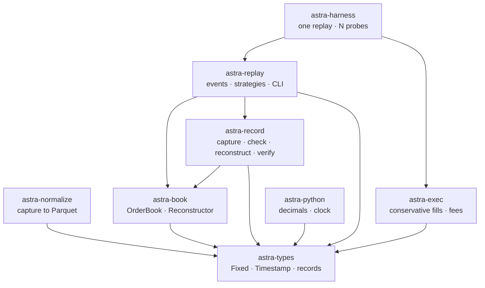
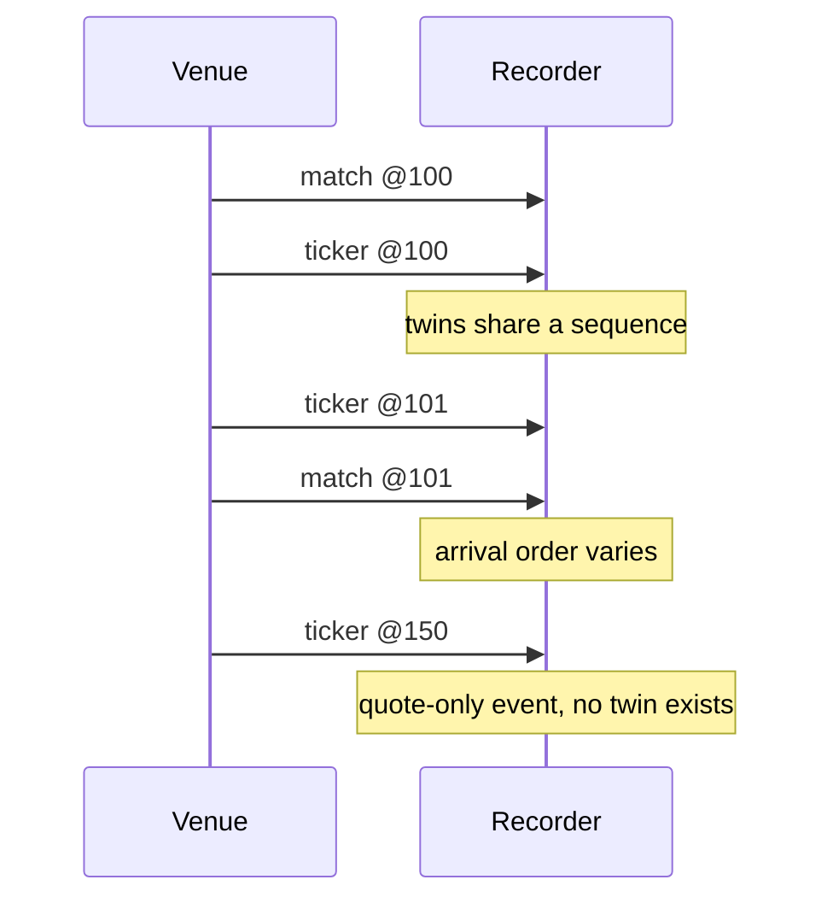
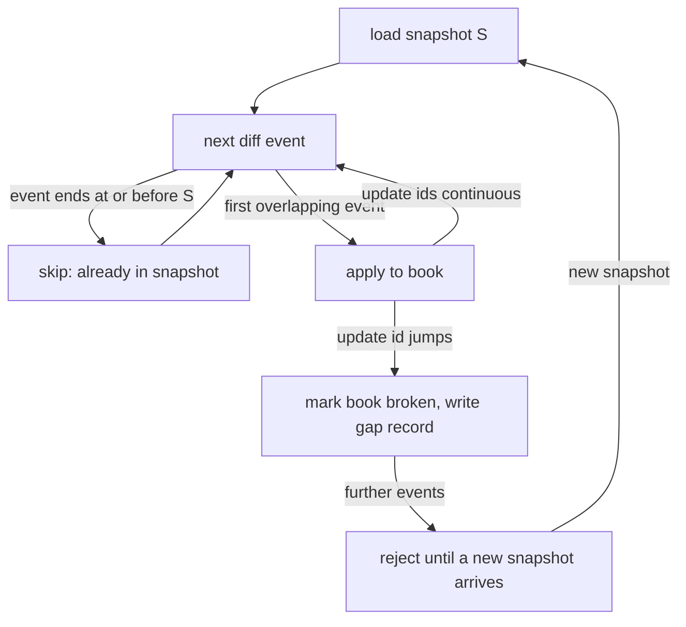
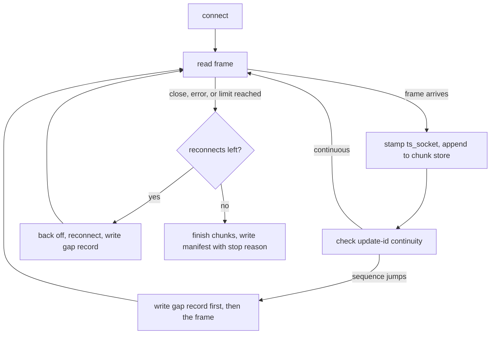
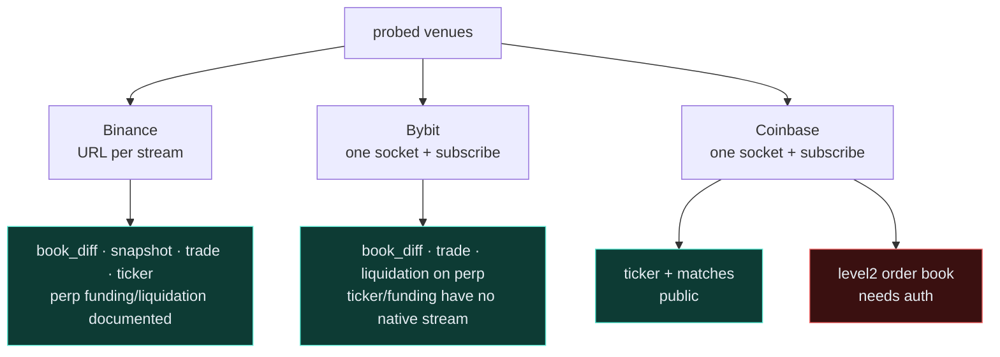

<p align="center">
  
</p>

# Astral Project


**An open, reproducible measurement layer for crypto markets.**

**Live site: [astral-project-ruddy.vercel.app](https://astral-project-ruddy.vercel.app/)**


Astra makes it possible to determine whether a trading idea actually survives
fees, slippage, latency, liquidity and realistic fills — and to reproduce that
determination later.

Historical research and simulation only. No execution, no trading, no capital.
A rigorous "this has no edge" is a successful result here.

## Contents

- [Status](#status)
- [What exists today](#what-exists-today)
- [Data flow](#data-flow)
- [Repository layout](#repository-layout)
- [Data model](#data-model)
- [Capture records](#capture-records)
- [Gap records](#gap-records)
- [Continuity checking](#continuity-checking)
- [Order book](#order-book)
- [Auditing a capture](#auditing-a-capture)
- [Replaying a capture](#replaying-a-capture)
- [Capture layout](#capture-layout)
- [Chunk format](#chunk-format)
- [Quickstart](#quickstart)
- [Feeds](#feeds)
- [Known limitations](#known-limitations)
- [Verification record](#verification-record)
  - [Top-of-book match gradient](#top-of-book-match-gradient)
  - [Latency benchmark](#latency-benchmark-live-measured-not-reference-hardware)
  - [Cross-machine reproduction](#cross-machine-reproduction)
- [Failures encountered](#failures-encountered)
- [Working rules](#working-rules)
- [What this is not](#what-this-is-not)
- [License](#license)

## Status

- **Done** — core types, chunked capture store, live capture on three venues
  (Binance, Bybit, Coinbase), reconnect with gap records, continuity rules
  where the venue offers checkable sequences, offline and in-band
  reconstruction, capture audit, adversarial tests, capture-path and
  book-update latency, Parquet normalization with proven byte-determinism,
  a replay engine covering book, trade, and top-of-book events whose
  live hashes are seed-independent across ten repetitions,
  and a benchmark harness turning captures plus configs into hashed reports.
- **Working on** — the 72-hour soak: operator scripted (`ops/soak.sh`), four
  streams, awaiting a supervised 72h window. Judging is mechanical
  (`ops/soak.sh check`: per-stream verdicts, non-zero exit on any issue).
  A brief trial run was started and
  stopped to leave a clean start; it proved the operator works, nothing more.
- **Next (one thing)** — judge the soak: zero sequence breaks, fewer than one
  unexplained gap per instrument-day, every chunk hash-verified. Then close
  Gate 1 or kill it on the evidence.

## What exists today

| Component | State |
| --- | --- |
| Workspace, build, tests, lint | DONE |
| CI (fmt + clippy + tests on push and PR) | DONE |
| `Fixed` fixed-point decimal | DONE |
| `Timestamp` nanosecond clock value | DONE |
| Venue, market type, symbol, channel identifiers | DONE |
| `CaptureRecord`, `CaptureManifest`, `CaptureFlags`, `GapMarker` | DONE |
| `astra-record init` capture layout | DONE |
| Chunked record store with SHA-256 integrity index | DONE |
| Live Binance capture, `book_diff` channel | DONE |
| All six mapped Binance channels captured | DONE |
| Reconnect with explicit gap records | DONE |
| Venue update-ID continuity checking | DONE |
| Order-book parsing and continuity rules | DONE |
| Bybit spot + perp `book_diff` capture | DONE |
| Bybit continuity rules (`u` strictly +1) | DONE |
| Bybit `trade` (spot) + `liquidation` (perp) capture | DONE |
| Coinbase probe (`ticker` + `matches` public, `level2` auth-walled) | DONE — evidence only, nothing mapped |
| Coinbase `trade` + `book_ticker` capture | DONE |
| Bybit remaining channels (`book_ticker`, `funding`, `book_snapshot`, `open_interest`) | NOT IMPLEMENTED — no native streams |
| Binance perp `funding` / `liquidation` live capture | NOT VERIFIED — futures endpoints geo-blocked from the build environment |
| Order-book state and level updates | DONE |
| Reconstruction from captured frames | DONE |
| Bybit in-band snapshot reconstruction | DONE |
| Snapshot bootstrap for a complete book | DONE |
| Bootstrap verified against a live venue snapshot | DONE |
| Top-of-book vs venue-published depth (levels 1–2: 300/300) | DONE |
| Capture audit (`check`: hashes, sequence, update IDs, gaps) | DONE |
| Adversarial parser tests + real 8-frame venue fixture | DONE |
| Capture-path latency (socket-read to stored, per frame) | DONE — p50 ~0.1ms, p99 ~1ms, max ~2ms over two live 30s runs |
| Live book with per-update latency (socket-read to book-updated) | DONE — Binance p50 15µs / p99 68µs, Bybit p50 6µs / p99 32µs, live-measured; failed applies counted as `errors`, unit-tested |
| Combined-stream fan-out capture (`--with`) | DONE — one connection, per-channel sibling dirs with own manifests, independent tracking, unknown streams counted |
| Project website (`website/`: static, framework-free, [live](https://astral-project-ruddy.vercel.app/)) | DONE — full content inlined (`website/docs/*.html` built from `docs/` via `website/build.py`, no external doc links); fluoro neon theme |
| Normalized event schema v1 (see `docs/`) | DONE — `book_diff`, `trade`, `top_of_book` implemented in `astra-normalize`; `funding`/`liquidation` reserved |
| Replay engine design v1 (see `docs/`) | DONE — implemented in `astra-replay`; scope now covers `book_diff` + `trade` + `top_of_book` |
| Replay event core (`astra-replay` lib: events, seeded context, hashing) | DONE — `BookDiff`/`Snapshot`/`Trade`/`TopBook` events, gap passthrough, per-type counters |
| Replay CLI with `book-top` demo strategy | DONE — live-verified, seed-independent hashes; `book-top` tracks the book only, trade/topbook frames counted not signaled |
| Normalizer `book_diff` to Parquet (`astra-normalize`) | DONE |
| Normalizer `top_of_book` to Parquet (Binance + Coinbase) | DONE — Binance live-verified; Coinbase parser-tested, live-blocked by network |
| Normalizer `trade` to Parquet (all three venues) | DONE — Binance live-verified; Bybit/Coinbase parser-tested, live-blocked by network |
| Exchange checksum validation | SUPERSEDED — no connected venue publishes book checksums (verified against Binance spot docs; Bybit and Coinbase publish none either; only Kraken does, and it is not connected). Correctness is proven by independent reference comparison instead |
| Normalised Parquet datasets | PARTIALLY IMPLEMENTED — `book_diff`, `trade`, and `top_of_book` normalize to Hive-partitioned Parquet; remaining channels counted and skipped |
| Deterministic replay | PARTIALLY IMPLEMENTED — event core covers `book_diff` + `trade` + `top_of_book` with `book-top` strategy and CLI, seed-independent live hashes; ten-replay ritual performed; latency methodology published; cross-machine procedure defined, proof open |
| Cost and execution model | PARTIALLY IMPLEMENTED — `exec-v1` lib + `astra-exec` probe CLI done (replay trade prints → fills with cited print, 9 unit + 2 integration tests); calibration and shadow mode open |
| Benchmark harness (`astra-harness`) | DONE — one replay pass (book-top + trade collection composed) + N probe simulations → canonical JSON + SHA-256 report hash; fail-closed config, tampered captures refused |

Nothing above is a stub dressed up as finished. The gaps are the roadmap.

## Data flow


```mermaid
flowchart LR
    A[Exchange WebSocket] --> B[raw immutable frames]
    B --> C[compressed chunks]
    C --> D[normalised Parquet]
    D --> E[deterministic replay]
    E --> F[research results]
    classDef done fill:#0d3b34,stroke:#5eead4,color:#e6edf3
    classDef partial fill:#3a2f10,stroke:#fbbf24,color:#e6edf3
    classDef missing fill:#1a1f2b,stroke:#4b5563,color:#8b949e
    class C done
    class A,B,D,E partial
    class F missing
```

| Stage | State |
| --- | --- |
| Exchange WebSocket | PARTIALLY IMPLEMENTED |
| Raw immutable frames | PARTIALLY IMPLEMENTED |
| Compressed chunks | DONE |
| Normalised Parquet | PARTIALLY IMPLEMENTED — `book_diff`, `trade`, `top_of_book` (`astra-normalize`); remaining channels counted and skipped |
| Deterministic replay | PARTIALLY IMPLEMENTED — event core, strategies, and CLI exist with live-verified determinism; cross-machine proof open |
| Research results | NOT IMPLEMENTED |

Partially implemented means three venues with uneven depth. Every mapped
channel is capturable; parsing rules exist for `book_diff`, `trade`, and
top-of-book, while continuity rules exist only where the venue offers a
checkable sequence (Binance spans, Bybit versions). `open_interest` has
no native stream anywhere and is deliberately unmapped.

## Repository layout


```mermaid
flowchart TD
    RP[astra-replay<br/>events · strategies · CLI]
    NZ[astra-normalize<br/>capture to Parquet]
    RC[astra-record<br/>capture · check · reconstruct · verify]
    BK[astra-book<br/>OrderBook · Reconstructor]
    EX[astra-exec<br/>conservative fills · fees]
    RT[astra-types<br/>Fixed · Timestamp · records]
    RP --> BK
    RP --> RC
    RP --> RT
    NZ --> RT
    RC --> BK
    RC --> RT
    BK --> RT
    EX --> RT
    HN[astra-harness<br/>one replay · N probes]
    HN --> RP
    HN --> EX
    PY[astra-python<br/>decimals · clock]
    PY --> RT
```

Arrows mean "depends on". Everything speaks the `astra-types` schema, so the
capture format, the book, and the audit tooling can never drift apart.

| Path | Purpose |
| --- | --- |
| `crates/astra-types` | The schema: decimal and timestamp primitives, identifiers, capture records |
| `crates/astra-book` | Order-book state: level updates, top of book, invariants |
| `crates/astra-record` | Lossless market-data capture and reconstruction from captures |
| `crates/astra-normalize` | Capture-to-Parquet normalization (`book_diff` + `trade` + `top_of_book`) |
| `crates/astra-replay` | Deterministic replay: event core (`book_diff` + `trade` + `top_of_book`), `book-top` strategy, CLI |
| `crates/astra-exec` | Conservative fills: limit-maker simulation over trade prints, required fee tier, plus a probe CLI (`exec-v1`) |
| `crates/astra-harness` | Benchmark harness (`bench-v1`): one replay pass + N probes → canonical hashed report, plus a local registry (`run --record`, `list`, `verify` with reproduction verdicts) |
| `crates/astra-python` | Python bindings foothold (`astra` module): exact decimal arithmetic and clock reads, embedded-tested; importable from a plain build (`crate-type` cdylib+rlib, copy `libastra.so` to `astra.so`) |
| `docs/normalized-schema.md` | The v1 spec for normalized Parquet tables, implemented for `book_diff`, `trade`, `top_of_book` |
| `docs/replay-design.md` | The v1 contract for the deterministic replay engine, implemented in `astra-replay` |
| `docs/cross-machine-repro.md` | The cross-machine reproduction procedure (hashes compared, execution open) |
| `docs/soak-runbook.md` | The 72-hour soak procedure: VPS sizing, shakedown, supervision, judging |
| `docs/execution-model.md` | The v1 fill/cost spec: conservative limit-maker fills, required fee tier (code open) |
| `docs/benchmark-harness.md` | The v1 harness spec: config, canonical report, determinism rules (implemented in `astra-harness`) |
| `docs/audit-2026-10-06.md` | Full-pipeline audit: method, 3 fixes, 13 ranked open findings, claim spot-check |
| `research/` | Published research notes, built to `website/research/` by `website/build.py` |
| `docs/failure-policy.md` | What each subcommand does with the same corruption (read off the code; unification open) |
| `docs/status-2026-10-10.md` | Project status with charts, flowcharts, gates, and the OSS endgame (figures sourced from the repo) |
| `ops/soak.sh` | The 72-hour soak operator: `start`, `status`, mechanical `check` verdict |
| `ROADMAP.md` | Gates with measurable definitions of done |

## Data model

| Type | Representation | Rule |
| --- | --- | --- |
| `Fixed` | `i128` scaled by 10^8 | decimal strings in, canonical eight places out; more than eight places is rejected rather than silently rounded; arithmetic rounds half away from zero |
| `Timestamp` | `i64` nanoseconds since epoch | ordered, serialised as raw nanoseconds |
| `Symbol` | validated `BASE/QUOTE` | uppercase ASCII alphanumeric with `.`, `_`, `-` |
| `Venue` | `binance`, `bybit`, `coinbase` | parsed case-insensitively, stored canonically |
| `MarketType` | `spot`, `perp_usdt` | |
| `Channel` | `book_diff`, `book_snapshot`, `trade`, `book_ticker`, `funding`, `liquidation` — plus `open_interest`, deliberately unmapped (no native stream) | |

Floating point is for derived analytics only, through
`to_f64_for_analytics`. Prices, quantities, fees and PnL never touch it.

## Capture records

| Field | Meaning |
| --- | --- |
| `seq` | position in the capture stream |
| `instrument` | venue + market type + symbol |
| `channel` | kind of market data |
| `ts_socket` | when the frame was read locally |
| `ts_exchange` | timestamp supplied by the venue, when present |
| `payload` | raw bytes, untouched |
| `flags` | capture quality bits |

| Flag | Meaning |
| --- | --- |
| `SEQUENCE_GAP` | the venue stream skipped a sequence number |
| `DUPLICATE` | the frame repeats one already recorded |
| `RESYNC` | the capture resynchronised after a gap |
| `STALE` | the data was too old to trust at capture time |
| `UNRELIABLE` | the surrounding window cannot be trusted |
| `TRUNCATED` | the payload was cut short |
| `SYNTHETIC` | the record was written by the recorder, not by the venue |

## Gap records

Two things produce a gap record: a feed that dropped and was re-established, and
a discontinuity in the venue's own update sequence. Both write one synthetic
record into the stream rather than letting the hole go unnoticed. It carries
`SYNTHETIC | SEQUENCE_GAP | UNRELIABLE` and a JSON payload:

```json
{ "started_at": 1790420019514000000,
  "ended_at": 1790420021770000000,
  "attempts": 1,
  "reason": "venue_close" }
```

`attempts` is the reconnect attempt count and is 0 for sequence gaps. `reason`
is `venue_close`, `read_error: ...` or `update_id_gap: expected N, saw M`.

A reader that filters out `SYNTHETIC` records sees only venue data; a reader
that does not will find the gap explicitly marked instead of silently
absorbing it. `frames_written` in the manifest counts venue frames only.

## Continuity checking

For Binance `book_diff` every event carries `U`, the first update id, and `u`,
the last. A well-formed stream has each event's `U` equal to the previous
event's `u` + 1. The recorder checks exactly that and writes the gap record
before the frame that breaks the rule.

| Venue | Channel | Rule | Basis |
| --- | --- | --- | --- |
| Binance | `book_diff` | next `U` equals previous `u` + 1 | `[U, u]` ranges tile the stream |
| Bybit | `book_diff` | next `u` equals previous `u` + 1 | single versions, measured strictly +1 over 357 messages |
| Coinbase | `ticker` + `matches` | no rule | twins share sequence numbers, arrival order varies, tickers advance with no match — nothing checkable |


```mermaid
sequenceDiagram
    participant V as Venue
    participant R as Recorder
    V->>R: match @100
    V->>R: ticker @100
    Note over R: twins share a sequence
    V->>R: ticker @101
    V->>R: match @101
    Note over R: arrival order varies
    V->>R: ticker @150
    Note over R: quote-only event, no twin exists
```

Sequence numbers above are schematic; the measurements are 121 sequenced
messages, 54 clean twin pairs, 6 tickers with no preceding same-sequence
match. Monotonicity holds, but monotonicity cannot detect drops — which is
the one thing continuity is for. So Coinbase gets gap-marking on disconnect
like everything else, and no sequence rule.

Continuity is only checked where the payload format is understood. Frames that
cannot be parsed are not checked, and the run reports `checked` alongside
`frames` so that a zero sequence-gap count is only meaningful when the two
numbers match.

## Order book

Reconstruction applies venue level updates to a two-sided book. A quantity of
zero removes the level; any other quantity sets it. Prices and quantities are
fixed-point decimals throughout, so no float rounding can move a level.

Without a snapshot the book is **partial**: levels never touched by an update
are absent. With one it is complete. Snapshots come two ways: a snapshot file
passed with `--snapshot` (Binance REST format), or in-band snapshot frames
inside the capture itself (Bybit sends `type: snapshot` on the same stream).
An in-band snapshot reloads the book mid-stream, so a second snapshot acts as
a resync — counted separately as `inband` rather than mixed into file-snapshot
accounting.

```sh
cargo run -p astra-record -- reconstruct --input ./capture --snapshot ./snapshot.json
```

The snapshot is a venue depth snapshot (`lastUpdateId` plus bids and asks).
Events ending at or before the snapshot id are skipped, the first overlapping
event applies, and every later event must continue the update-id sequence or
the book is marked broken. A broken book rejects all further events until a
new snapshot arrives; it never silently resumes.


```mermaid
flowchart TD
    S[load snapshot S] --> E[next diff event]
    E -->|event ends at or before S| K[skip: already in snapshot]
    K --> E
    E -->|first overlapping event| A[apply to book]
    A -->|update ids continuous| E
    A -->|update id jumps| G[mark book broken, write gap record]
    G -->|further events| X[reject until a new snapshot arrives]
    X -->|new snapshot| S
```

```sh
cargo run -p astra-record -- reconstruct --input ./capture
```

Reports how many frames were applied, skipped, or rejected, how many could not
be parsed, the level counts, top of book, mid, spread, and whether the book
ever crossed. A crossed book is a reconstruction error, and the run says so
rather than presenting the numbers anyway.

## Auditing a capture

```sh
cargo run -p astra-record -- check --input ./capture
```

Verifies every chunk against its recorded SHA-256 before decoding it, then
audits the whole capture: sequence continuity, update-ID continuity for frames
whose format is understood, gap records with their reasons, and the time span.
It streams chunk by chunk, so a multi-day capture never needs to fit in memory.
A corrupt chunk fails the run with an integrity error; gaps and breaks are
reported as findings with a verdict of `healthy` or `issues found, see above`.
Note the exit-code contract: `check` exits non-zero only when the audit itself
fails (corrupt chunk, torn manifest, unreadable input). An `issues found`
verdict still exits zero — the findings are the result, not a crash.

Judging the soak is mechanical:

```sh
ops/soak.sh check
```

prints a per-stream `verdict <name> healthy|ISSUES|ERROR` plus a final
`soak_verdict` line, and exits non-zero when any stream is not healthy.
Gate 1 passes a stream when `check` is `healthy`: zero sequence breaks,
every chunk hash-verified, and every gap recorded with its window marked
unreliable. The gap-rate bar (<1 unexplained gap per instrument-day) is read
off the `gap` lines over the 72h window, not asserted from short runs.

## Replaying a capture

```sh
cargo run -p astra-replay -- --input ./capture --seed 7 --strategy book-top
```

Re-emits the capture's events in order through a strategy. `book-top`
maintains a live book and emits top-of-book per book event — except while
broken: a gap marker or a venue discontinuity silences it until a fresh
snapshot heals it, exactly like the reconstructor it mirrors. Every signal feeds a
SHA-256 hash printed at the end. Same capture plus same seed always yields
the same hash — replay twice with different seeds and differing hashes mean
the strategy depends on randomness it should not. `book-top` ignores trade
and top-of-book frames (counted as `trades`/`topbooks`, zero signals from them).

```text
frames      96
events      96
trades      0
topbooks    0
gaps        0
skipped     0
signals     96
signal_hash f66ae25f...
```

Gap markers arrive as gap events, unparseable frames and other channels are
counted as skipped, and a torn manifest fails loudly instead of replaying
a capture that is not whole. `trade` bundles expand per print (`print_index`);
`book_ticker` frames arrive via `on_top_of_book`. The full contract lives in
`docs/replay-design.md`; running it on a second machine is described in
`docs/cross-machine-repro.md`.

## Capture layout

```text
capture/
├── manifest.json
└── frames/
    ├── index.json
    ├── chunk-000000.zst
    ├── chunk-000001.zst
    └── ...
```

`manifest.json` records the schema version, a generated capture id, the
creation time, the instrument, the channel, the number of frames written and
the reason capture stopped. A capture that ended because the venue dropped the
connection says so; it never looks like a clean finish.

`index.json` records, for every chunk: its name, the first and last sequence
number it holds, the record count, the byte size and the SHA-256 of the
compressed file. Reading a capture verifies every chunk against that hash
before decoding it, so silent corruption is detected rather than absorbed.

## Chunk format

A chunk is a zstd-compressed stream of length-prefixed records: a four byte
little-endian length followed by the encoded record. Payload bytes are stored
exactly as received and are never re-encoded, truncated or interpreted.

Chunks roll after a fixed number of records. The chunk writer continues the
chunk sequence in an existing directory — but capture refuses to start in one
that already holds chunks, instead of merging new frames over old sequence
numbers. Resume is future work; every live path captures into a fresh
directory.

## Quickstart

```sh
cargo build --workspace
cargo test --workspace

cargo run -p astra-record -- init \
  --output ./capture \
  --venue binance \
  --market spot \
  --symbol BTC/USDT \
  --channel book_diff
```

Capture from a live feed:

```sh
cargo run -p astra-record -- capture \
  --output ./capture \
  --venue binance \
  --market spot \
  --symbol BTC/USDT \
  --channel book_diff \
  --duration-secs 3600
```

The run stops at the end of the duration, at `--max-frames`, on Ctrl-C, or when
the feed cannot be kept alive, and records which of those happened in the
manifest. `--url` overrides the derived feed for local testing.

A dropped connection is re-established up to `--max-reconnects` times (default
5) with exponential backoff, and every reconnection writes a gap record. Pass
`--max-reconnects 0` to stop at the first drop instead.

Capture two channels over one connection, each landing in its own capture dir
with its own manifest and tracking:

```sh
cargo run -p astra-record -- capture \
  --output ./val --venue binance --market spot --symbol BTC/USDT \
  --channel book_diff --with book_snapshot \
  --duration-secs 3600
```

`./val` holds `book_diff`, `./val-book_snapshot` holds the fanout. Stop limits
apply to the primary channel; fanouts follow. Frames that unwrap to no known
stream are counted as `unknown` and reported, never silently absorbed. With
`--url`, the URL is used as-is and must already be a combined stream URL;
without it, the combined URL is derived and validated first.


```mermaid
flowchart TD
    A[connect] --> B[read frame]
    B -->|frame arrives| C[stamp ts_socket, append to chunk store]
    C --> D[check update-id continuity]
    D -->|continuous| B
    D -->|sequence jumps| E[write gap record first, then the frame]
    E --> B
    B -->|close, error, or limit reached| F{reconnects left?}
    F -->|yes| G[back off, reconnect, write gap record]
    G --> B
    F -->|no| H[finish chunks, write manifest with stop reason]
```

## Feeds

| Venue | Market | Channel | Stream |
| --- | --- | --- | --- |
| binance | spot | book_diff | `wss://stream.binance.com:9443/ws/<symbol>@depth@100ms` |
| binance | spot | book_snapshot | `wss://stream.binance.com:9443/ws/<symbol>@depth10@100ms` |
| binance | spot | trade | `wss://stream.binance.com:9443/ws/<symbol>@trade` |
| binance | spot | book_ticker | `wss://stream.binance.com:9443/ws/<symbol>@bookTicker` |
| binance | perp_usdt | book_diff | `wss://fstream.binance.com/ws/<symbol>@depth@100ms` |
| binance | perp_usdt | funding | `wss://fstream.binance.com/ws/<symbol>@markPrice@1s` |
| binance | perp_usdt | liquidation | `wss://fstream.binance.com/ws/<symbol>@forceOrder` |
| bybit | spot | book_diff | `wss://stream.bybit.com/v5/public/spot` + subscribe `orderbook.50.<SYMBOL>` |
| bybit | perp_usdt | book_diff | `wss://stream.bybit.com/v5/public/linear` + subscribe `orderbook.50.<SYMBOL>` |
| bybit | spot | trade | `wss://stream.bybit.com/v5/public/spot` + subscribe `publicTrade.<SYMBOL>` |
| bybit | perp_usdt | trade | `wss://stream.bybit.com/v5/public/linear` + subscribe `publicTrade.<SYMBOL>` |
| bybit | perp_usdt | liquidation | `wss://stream.bybit.com/v5/public/linear` + subscribe `allLiquidation.<SYMBOL>` |
| coinbase | spot | trade | `wss://ws-feed.exchange.coinbase.com` + subscribe `matches` on `<BASE>-<QUOTE>` |
| coinbase | spot | book_ticker | `wss://ws-feed.exchange.coinbase.com` + subscribe `ticker` on `<BASE>-<QUOTE>` |

The four spot channels are verified against the live venue — each captured real
payloads. The two perp channels below are **documented**: both are native
Binance USDS-M futures streams (`@markPrice@1s` is the mark-price and funding
stream; `@forceOrder` is the liquidation stream), confirmed against the
venue's published stream names, but not yet live-verified because the futures
endpoints are geo-blocked from the build environment.

`open_interest` has no native WebSocket stream — open interest is a
REST-sourced, generated channel — so it is deliberately not mapped until a
REST-derived capture exists. Funding and liquidation are futures-only, so
requesting them for spot is refused with an explicit not-implemented error.
Bybit is connected for `book_diff` on spot and perp, via one connection plus a
JSON subscribe message (`orderbook.50.<SYMBOL>`). Every other Bybit channel is
not implemented. Unlike Binance's URL-per-stream model, Bybit multiplexes over
a single socket, so the recorder sends the subscribe message on every connect
— including reconnects.


```mermaid
flowchart TD
    V[probed venues] --> B[Binance<br/>URL per stream]
    V --> Y[Bybit<br/>one socket + subscribe]
    V --> C[Coinbase<br/>one socket + subscribe]
    B --> BO[book_diff · snapshot · trade · ticker<br/>perp funding/liquidation documented]
    Y --> YO[book_diff · trade · liquidation on perp<br/>ticker/funding have no native stream]
    C --> CT[ticker + matches<br/>public]
    C --> CL[level2 order book<br/>needs auth]
    classDef ok fill:#0d3b34,stroke:#5eead4,color:#e6edf3
    classDef no fill:#3a1010,stroke:#f87171,color:#e6edf3
    class BO,YO,CT ok
    class CL no
```

| Probed, not connected | Finding |
| --- | --- |
| Coinbase `level2` order book | refused by the venue: needs authentication — no `book_diff`, no reconstruction |
| Coinbase `ticker` + `matches` | public, 122 frames in 10s, sequenced but not strictly checkable (see Continuity). **Now mapped and captured live: 33 matches and 35 tickers in 8s** |
| Coinbase symbols | fiat-quoted (`BTC-USD` from `BTC/USD`); cross-exchange work against USDT pairs needs FX handling |

## Known limitations

- `ts_exchange` is not populated at capture time. Reading the venue timestamp
  out of the payload happens downstream: Binance `E` millis populate it for
  `book_diff` in replay and normalization (other venue/channels carry nothing
  checkable and stay null).
- Ctrl-C is handled, but a hard kill loses the chunk currently in memory. The
  capture manifest and every closed chunk survive; the partial one does not.
- Three venues probed, three connected where public. Binance maps one URL per
  stream; Bybit and Coinbase multiplex over one socket with a subscribe message
  (different envelopes: `op`/`args` vs `type`/`channels`). Coinbase offers no
  public order book (see Feeds), so it has no continuity rule and no
  reconstruction path without API keys.
- Continuity checking has a rule for Binance `book_diff` (`[U, u]` spans) and
  Bybit `book_diff` (versions strictly +1). The `book_ticker` payload does
  carry an update id and may get a rule later.
- Continuity checking assumes the venue stream is strictly sequential. A venue
  that coalesces or reorders updates would produce false gaps; no such case has
  been observed on the data captured so far.
- The reconstructed book is **complete only with a snapshot**. Without one,
  levels never touched by an update are absent and top-of-book is indicative
  rather than authoritative.
- Two connections to the same venue are served by different venue servers, so a
  depth snapshot from one connection disagrees with a reconstruction from
  another at the book's edge. Top-of-book matches 300/300; level 10 does not
  always. An exact full-depth comparison needs a single combined connection.
- The venue REST endpoint is intermittently unreachable from the build
  environment (TLS interception with `UnknownIssuer` on `api.binance.com`).
  Snapshot and stream validation currently runs through the official public
  mirrors `data-api.binance.vision` and `data-stream.binance.vision` with a
  `--url` override, and the README says so instead of pretending otherwise.
- The 72-hour soak has not been run. Short captures (30–60 s) are clean, but
  that is not evidence about days of sustained operation.
- The soak runs on a cheap VPS, not a laptop: sleep kills connections, and a
  paused run is not a soak. Sizing, shakedown, supervision, and judging are in
  `docs/soak-runbook.md`. If the machine dies
  mid-soak, the partial capture plus its `check` output is still evidence, and
  the soak restarts from zero — a restarted soak is a new soak, not a
  continuation.
- Latency is measured from socket-read to record-appended in the memory buffer,
  and separately from socket-read to book-updated for the live book. Chunk
  compression happens later on roll, there is no fsync, and the Binance live
  book is partial without a REST bootstrap at startup (the Bybit one is
  complete via in-band snapshots).

## Verification record

What has actually been checked, and what has not. Nothing here is inferred from
the fact that the code compiles. Post-audit closures are tracked per-row
below; the audit itself (`docs/audit-2026-10-06.md`) keeps a follow-ups note
so the report stays evidence while the fixes move.

### Top-of-book match gradient

300 live frames checked against the venue's own published book, per depth:

```text
depth   checks   matched
 1       300      300   ████████████████████  100%
 2       300      300   ████████████████████  100%
 5       300      298   ████████████████████   99%
10       300      247   ████████████████░░░░   82%
```

Top-of-book is exact. The level-10 shortfall has two distinct mechanisms,
proven separately. With a complete (1000-level REST) bootstrap on two
connections, deep mismatches are inter-server disagreement. With a partial
(10-level depth10) bootstrap on one connection, they are rank drift: levels
outside the bootstrap that no diff ever touches drift into the top 10
invisibly — proven by a missing level appearing in zero diff messages and
outside the bootstrap, yet present in references. The gradient is exactly
what partial-bootstrap theory predicts: accuracy decays with depth, because
deep levels update rarely.

### Latency benchmark (live-measured, not reference hardware)

Two halves, measured separately on live feeds and printed by every capture:

```text
latency_us  p50 108.0 p99 761.0 max 1400.0 (300 frames, read to stored)
book_us     p50 15.0 p99 68.0 max … (updates 272, errors 0, read to book-updated)
```

| Half | What is timed | Binance spot | Bybit spot | Target |
| --- | --- | --- | --- | --- |
| Store | socket-read → record-appended in the memory buffer | p50 108µs / p99 761µs / max 1.4ms (≈300 frames) | p50 130µs / p99 1076µs / max 2.2ms (≈300 frames) | p99 < 5ms |
| Book | socket-read → book-updated (live book) | p50 15µs / p99 68µs (272 updates, partial book — no REST bootstrap at startup) | p50 6µs / p99 32µs (730 updates, complete via in-band snapshots) | p99 < 5ms |

Methodology, read before citing: chunk compression happens later on roll,
there is no fsync, and the numbers come from two live 30s runs — not from
named reference hardware and not from a soak. Reproduce with any capture: the
`latency_us` and `book_us` lines are the benchmark. A published reference
benchmark on fixed hardware is still open (see ROADMAP Gate 1).

### Cross-machine reproduction

Procedure defined in `docs/cross-machine-repro.md`, execution open. Same
capture bytes + same commit + same seed must yield equal `healthy` verdicts,
equal Parquet tree hashes, and equal `signal_hash` on both machines — no
"close enough". The first same-OS, same-commit run flips ROADMAP Gate 1
"Cross machine reproducibility" from OPEN to VERIFIED (or records exactly
which equality broke).

| Claim | Evidence | Status |
| --- | --- | --- |
| Value types round-trip exactly | unit tests, `cargo test --workspace` | VERIFIED |
| Chunk store round-trips records byte for byte | unit tests | VERIFIED |
| Chunk store detects a corrupted chunk | test flips one byte and expects an integrity error | VERIFIED |
| Integrity hashes are truthful | recorded SHA-256 cross-checked against the system `sha256sum` | VERIFIED |
| Capture writes frames from a real WebSocket | end-to-end run: handshake, frames, manifest and index on disk | VERIFIED |
| Live Binance capture | 60 second run: 601 frames at the expected 10/s rate, payloads are `depthUpdate` events, chunk hash matches the system `sha256sum` | VERIFIED |
| Reconnect writes gap records and continues | unit tests drop the feed mid-capture and check the marker, its span and the continued sequence | VERIFIED |
| Update-ID continuity checking | parser tested against a real captured Binance frame; live run checked 601 of 601 frames and reported 0 gaps; unit tests inject a discontinuity and confirm it is detected and marked | VERIFIED |
| Feed URLs for Binance spot and perp | unit tests | VERIFIED |
| Order-book level updates, including removals | unit tests plus a real captured frame that contains two zero-quantity removals | VERIFIED |
| Reconstruction from captured frames | 601-frame live capture: all 601 applied, 0 unchecked, 0 invalid, 280 bid and 258 ask levels, spread of one tick, book never crossed | VERIFIED |
| Snapshot bootstrap against a live venue snapshot | 400-frame capture with a mid-stream snapshot: 133 pre-snapshot events skipped (matches an independent count), 267 applied, 0 gaps, 0 rejected, overlap event at exactly S+1, spread of one tick, book never crossed | VERIFIED |
| Top-of-book vs venue-published depth | 300-frame live capture vs depth10 reference: best bid/ask and levels 1–2 match 300/300; deeper mismatches traced to the two streams being served by different venue servers, not to book errors | VERIFIED with a stated boundary |
| Capture audit | unit tests for tamper detection, sequence breaks, update-ID gaps, gap listing and unchecked counting; both genuine live captures audit `healthy` with frame rates matching the venue's 10/s | VERIFIED |
| Hostile parser inputs | 26 malformed payloads across all three parsers — empty, truncated, wrong types, negative and overflowing ids, BOM bytes, binary garbage — all rejected, none panicked | VERIFIED |
| 72-hour soak (4 streams, 2 venues) | operator scripted and trial-started; awaiting a supervised 72h run. Judged at the end, not before | NOT RUN |
| Real 8-frame venue sequence | 8 consecutive genuine `depthUpdate` frames committed as a fixture: continuity holds across all 8 in CI, reconstruction applies all 8 with no gaps and an uncrossed book | VERIFIED |
| Capture-path latency | two live 30s runs (≈300 frames each): p50 108/130µs, p99 761/1076µs, max 1.4/2.2ms from socket-read to record-stored. Well under the 5ms target; this is the store half of the pipeline — the book half is measured in the next row | VERIFIED |
| Book-update latency | Binance live: 272 updates, p50 15µs / p99 68µs. Bybit live: 730 updates, p50 6µs / p99 32µs, book snapshot-bootstrapped in-band. Both far under target; the Binance live book is partial (no REST bootstrap at startup), the Bybit one complete | VERIFIED with a stated boundary |
| Multi-channel capture | four Binance spot channels verified live against the venue: `book_diff` `depthUpdate`, `book_snapshot` `lastUpdateId`+levels, `trade` events, `book_ticker` `u/b/B/a/A` | VERIFIED |
| Bybit `book_diff` capture | spot and perp verified live: subscribe confirmed, 1 snapshot + deltas each (`316`/`374`), zero gaps. Continuity rules came later; at capture time these runs reported `checked 0` | VERIFIED |
| Bybit continuity checking | `u` measured strictly +1 across 357 live messages; live run checks 424/424 market frames with zero gaps (the 1 unchecked frame is the subscribe confirmation, not market data) | VERIFIED |
| Coinbase `level2` auth wall | venue refuses unauthenticated subscription verbatim; no order book, no reconstruction path without API keys | VERIFIED negative result |
| Coinbase `ticker` + `matches` sequencing | 121 sequenced messages: twins share sequence numbers, arrival order varies, tickers advance with no match — no strict rule holds, so none is claimed | VERIFIED analysis |
| Coinbase `trade` + `book_ticker` capture | 33 genuine matches and 35 tickers in 8s live runs; both report `checked 0`, correctly, since no continuity rule exists | VERIFIED |
| Bybit in-band reconstruction | 425-frame live capture: 1 in-band snapshot bootstraps the book, 423 diffs applied, 0 gaps, 50/50 levels, one-tick spread, never crossed | VERIFIED |
| Bybit `trade` capture | 72 frames in 8s against `publicTrade.BTCUSDT`; payloads carry documented `T/s/S/v/p/seq` trade fields | VERIFIED |
| Normalizer `book_diff` to Parquet | live 102-frame capture normalizes to 102 rows in one Hive-partitioned file; decimals exact through the round trip; validation rejects bad batches whole; no third-party Parquet reader on this machine, so cross-validation is read-back via the same stack | VERIFIED with a stated boundary |
| Normalizer `trade` to Parquet | live 347-frame Binance capture normalizes to 347 rows; Bybit bundle expansion and Coinbase side/time parsing covered by parser tests with real and documented fixtures; Bybit/Coinbase live normalization blocked by intercepted network, not by code | VERIFIED with a stated boundary |
| Normalizer `top_of_book` to Parquet | live 464-frame Binance capture normalizes to 464 rows; Coinbase parsing covered by parser tests with a real fixture, live-blocked by network | VERIFIED with a stated boundary |
| Normalizer determinism | same 97-frame live capture normalized twice: identical file trees, identical SHA-256. CI asserts byte equality on every run | VERIFIED |
| Live replay determinism | 96-frame live capture replayed under seeds 7 and 99 via `book-top`: 96 signals each, identical hashes. Seed-independence measured, not assumed | VERIFIED |
| Replay `trade` + `top_of_book` events | Bybit 2-print bundle expands to 2 trade events with `print_index`; Binance `bookTicker` fixture replays to 1 topbook event; unparseable trade frames and out-of-scope channels counted not crashed. Parser-tested + CI (10 replay tests), live multi-channel soak still open | VERIFIED with a stated boundary |
| Ten-replay ritual | 151-frame live capture replayed 10 times under one seed: 10 identical signal hashes (`b098a501…`). The Gate 1 repetition bar, performed on real data | VERIFIED |
| Bybit `liquidation` connectivity | subscribe to `allLiquidation.BTCUSDT` accepted, connection held for the full duration, zero liquidation events in 8s. The channel is proven connected, not proven delivering — absence of liquidations is market state, not a test result | CONNECTED, NOT VERIFIED |
| Perp channels (`funding`, `open_interest`, `liquidation`) | `funding` (`@markPrice@1s`) and `liquidation` (`@forceOrder`) confirmed as native futures streams against the venue's published stream names; `open_interest` has no native stream (REST-sourced) so its mapping was removed. Live capture not possible — futures endpoints are geo-blocked | PARTIALLY VERIFIED |
| Losslessness over a long soak | none | NOT VERIFIED |
| Full-depth match against a second connection's snapshot | none — two connections are served by different venue servers, so this comparison measures inter-server disagreement, not reconstruction error | NOT A VALID TEST |
| Same-connection fan-out capture | one connection, 246 diffs + 247 snapshots routed to sibling dirs with own manifests; zero gaps, unknown streams counted | VERIFIED |
| Decisive full-depth comparison | complete REST bootstrap + same-connection streams: 150 post-snapshot checks at depth 10, 149 exact matches, 1 dust-quantity transient (same prices, 5th-decimal quantities — a sub-millisecond race between the venue's publishers) | VERIFIED |
| Exchange checksum validation | none — verdict, not a gap: Binance publishes no book checksums on any spot stream (verified against the official stream docs); Bybit and Coinbase publish none either. Only Kraken does among reachable majors, and it is not connected. The correctness claim this row was meant to carry is proven instead by reference comparison (rows above) | SUPERSEDED |
| Full-pipeline audit 2026-10-06 | 145 tests green, clippy clean, every production `unwrap` inspected; 3 bugs fixed (u64::MAX overflow, soak backoff, manifest trust), 13 open findings ranked in `docs/audit-2026-10-06.md` | REPORTED |
| Exec-v1 unit acceptance | 9 unit tests: through-print fills both sides, near-miss expiry, wrong-side prints, gap void, empty stream, exact fees to the raw unit, explicit zero tier, rejected non-positive orders; replay wiring and live probes open | UNIT-TESTED, needs live proof |
| Exec probe wiring | 2 integration tests over real-format captures on disk: fill cites its through-print (`print_seq`), gaps void, expiry; probe CLI demoed on empty and malformed inputs (clean errors, correct exits); live-venue probes open | WIRED, needs live proof |
| Live-book error counting | negative-quantity diff counted as `errors` while `updates` counts successes; capture output prints both | UNIT-TESTED |
| Check output golden format | `check` rendering moved into the lib with line-by-line golden tests, so the `verdict` line `soak.sh` parses cannot drift silently; CLI output verified byte-identical after the move | PINNED |
| CLI output contracts pinned | `capture` (`frames` line parsed by `soak.sh status`), `replay` (`signal_hash`), and `exec` reports all render through golden-tested lib functions; byte-identical output verified live after each move | PINNED |
| Remaining CLI formats pinned | `init`, `reconstruct`, and `verify` reports moved into the libs with golden tests (including the empty-book and nothing-checked branches); finding 11 fully closed | PINNED |
| Parquet decimal range gate | hostile 13-digit values parse as `Fixed` but never fit `Decimal128(20,8)`; all three validators now reject out-of-range batches whole (TDD: test failed first, then the fix) | GATED |
| Corrupt prints never fill | non-positive trade prints are skipped by `exec-v1` (a fill needs a real counterparty at a real price); regression test with negative and zero prints | GUARDED |
| Corrupt sizes never fill | non-positive print quantities join prices in the skip rule (`Print` carries `quantity` now); hostile zero/negative sizes covered in the same regression test | GUARDED |
| Benchmark harness determinism | same capture + config run twice → byte-identical reports; tampered manifest refused with no report written; unknown fields, strategies, and versions refused; golden report-shape test | VERIFIED (fixture; live multi-channel run open) |
| Registry roundtrip | record → list → verify over fixture captures: idempotent re-record, single listing, exact reproduction, mismatch on different outcomes, loud refusal of unknown hashes, empty dir lists empty; `verdict reproduced` demoed live | VERIFIED (fixture + live CLI) |
| Second replay strategy | `trade-tally` counts prints by side with its own unknown bucket and one end-of-stream signal; harness dispatches `book-top`/`trade-tally` (unknown refused); same probes under different strategies give different signal hashes | TESTED |
| Verify mismatch exits non-zero | `MISMATCH` verdicts fail the process (exit 1), so scripts judge reproductions mechanically like `soak.sh check` judges captures; match exits 0, both demoed live | VERIFIED live |
| Venue event time for Binance diffs | `E` millis parse to `ts_exchange` in replay events and normalized rows (other venues/channels stay null); fixture-pinned plus a read-back test | WIRED |
| Canonical sides enforced at validation | non-null trade sides must already be Buy/Sell (parsers fail closed upstream); anything else stops the batch instead of laundering a future parser bug | ENFORCED |
| BookTop breaks like the book | gaps and venue discontinuities silence `book-top` until a snapshot heals it, per the replay design contract; post-gap diffs emit nothing; reworked regression test | ENFORCED |
| Snapshot heal path tested | a broken `book-top` resumes emitting after a fresh snapshot with the snapshot's levels; break and heal both covered | TESTED |
| Arithmetic overflow fails loudly | absurd size at max fee tier overflows instead of wrapping into a tiny fee; `ArithmeticOverflow` names it | TESTED |
| Reconnects reset the audit baseline | a fresh venue baseline after a reconnect reports `connection_gaps` without a spurious update-ID finding, mirroring the recorder's own reset | TESTED |
| Reconnects resume reconstruction | connection gaps reset the book's continuity baseline (quarantine stays sticky); fresh post-reconnect spans apply instead of rejecting forever | TESTED |
| Registry lists distinct runs sorted | two different configs recorded side by side list in hash order with correct counts; listing is stable, not incidental | TESTED |
| Verify hashes are validated before joining | `verify` refuses anything that is not a 64-char lowercase report hash, so traversal inputs can never escape the registry directory; well-formed misses fail on I/O instead | GUARDED |
| Non-UTF8 registry entries skipped | directory names that cannot be hashes (non-UTF8 bytes) list as nothing instead of phantom empty-hash entries | GUARDED |
| Record-seq saturation guarded | the audit's own `seq` walk had the same `+1` overflow class as update IDs; wrapping arithmetic plus a hostile-MAX regression test | GUARDED |
| Partitions key on full instrument | a mixed-venue capture used to merge rows into the first row's file (date-only grouping); the key is now venue, market, symbol, channel, date, sorted for determinism | FIXED |
| Index counts verified on read | hashes prove the bytes; decoded length is now checked against the index count, so hand-edited counts fail reading instead of passing silently | VERIFIED |
| Undecodable aborts covered by tests | replay and normalize paths assert refusal on garbage gap markers (reconstruct and compare already covered) | TESTED |
| Report writes create parents | `write_report_file` makes missing output directories instead of failing the run on path choice; bare filenames still write in place | TESTED |
| Local captures avoid /tmp | two long captures were lost to system cleaners mid-run; the runbook now directs local trial runs to persistent disk (`./target/`, `$HOME`) | LEARNED |
| Harness CLI formats pinned | `run`, `list`, and `verify` reports render through golden-tested lib functions; live output verified byte-identical after the move | PINNED |
| Live ritual 2026-10-08 | fresh 600-frame Binance capture: normalized twice → byte-identical Parquet; replayed 10× under one seed → one unique signal hash; a first-pass content-hash recipe mismatched on filenames and was corrected to contents-only | VERIFIED |
| Soak-scale memory profile | synthetic 300k-frame capture: `check` ~10 MB (streams), `replay` ~130 MB, `normalize` ~340 MB peak RSS (debug, small payloads — a floor); full-soak judging needs GB or streaming; recorded in the runbook | MEASURED |
| Empty-bundle rule pinned | a zero-print trade bundle normalizes to zero rows (nothing to placeholder) while replay counts it skipped; garbage keeps a null row; regression test plus policy-table row | PINNED |
| Error variant says what it means | `FeeOverflow` (also raised on notional overflow) renamed to `ArithmeticOverflow`; decimal bound pinned to exactly 10^20 - 1 by unit test after a 29-digit typo slipped through once | HYGIENE |
| Reconstruct gated like every reader | `reconstruct` verifies schema version and manifest frame count before rebuilding, failing loud on foreign or half-written captures | GATED |
| Trade sides fail closed | Bybit/Coinbase side labels canonicalize to Buy/Sell; anything else stores as unknown (`None`) with the print preserved, never verbatim | HARDENED |
| Reconstruct counts connection gaps | gap markers classified on the walk: connection-type counted, sequence-type left to the reconstructor's own break, undecodable surfaced; overlap behavior documented in code | COUNTED |
| Reconstruct counts sequence breaks | scrambled `seq` order counted in `seq_breaks` instead of silently rebuilding; finding 4 fully closed | COUNTED |
| Undecodable gaps abort reconstruction | a gap marker no parser understands fails the run (`UndecodableGap`) like normalize/replay; an old test using a fake marker now uses a real one | UNIFIED |
| Undecodable markers abort comparison | the last silent skip in the failure table: `verify` fails on undecodable synthetic records on either side instead of comparing past an unseen hole | UNIFIED |
| Bounded failure strings, documented expects | venue error text in gap/stop reasons capped at 240 chars (marked when cut); the last bare production `unwrap` now states its guard | HARDENED |
| Gap numbers survive the audit | `check` parses `expected`/`saw` out of capture-written gap markers instead of reporting zeros; unparseable shapes degrade gracefully with reasons intact | REPORTED |
| Seeded parser fuzzing | 2000 noise payloads plus 1500 mutated real frames through every venue/channel parser; panics fail the run, results may parse or not | FUZZED |
| Research note 001 | 15,655 live trade prints over 10 min: taker count swings 12.8%–95.3% buys per minute while volume sums to 50.6% — the imbalance lives in small prints; churn math kills the naive signal before execution is modeled (`research/001-taker-count-vs-volume.md`) | PUBLISHED (single window, stated limits) |
| Research note 002 | 14,979 prints over 30 min with one recorded reconnect gap: median print ~$8, top 1% carries 46.4% of volume; equal-weighted signals let dust outvote size, sized signals face note 001 (`research/002-dust-plus-whales.md`) | PUBLISHED (single window, stated limits) |
| Normalize reruns append, never overwrite | rerunning into one output dir duplicates rows (`part-N` continues); idempotency is fresh dirs, documented in the schema spec; finding 7 closed as documented | DOCUMENTED |
| Used capture dirs refuse, not merge | starting a capture where chunks exist errors loudly (`CaptureExists`) instead of colliding sequence numbers; resume stays future work | GUARDED |
| `init` refuses used dirs too | the same guard covers initialization, which rewrote manifests under existing chunks; fresh dirs initialize normally | GUARDED |
| Tampered registry entries fail closed | rewriting a stored config changes the re-run, so verification compares unequal and returns false instead of trusting the directory name | TESTED |
| Soak dir dated and overridable | `ops/soak.sh` defaults to `data/soak-<date>` (the stale 2026-09-29 default is gone) with `SOAK_DIR` override, documented in the runbook | OPERATIONAL |
| Soak guards against double-start | `start` refuses already-running streams and chunk-holding dirs instead of launching doomed duplicates; `status` reports never-started dirs distinctly (both paths demoed) | OPERATIONAL |
| Python bindings foothold | `astra` module with exact decimal arithmetic and clock reads, tested through the embedded interpreter on Python 3.14; `import astra` packaging (maturin) stays open | TESTED |
| `import astra` without maturin | cdylib+rlib crate types keep tests green while `cargo build` produces an importable module (verified: parse/mul/clock/div0 live in Python 3.14) | IMPORTABLE |
| Book updates count applied events only | rejected and pre-snapshot events touch neither counter (they change nothing and carry no bad data); `errors` stays reserved for invalid levels | COUNTED |
| Compare gated like every reader | `verify` checks both manifests (version plus venue counts) before comparing; the last blind reader now refuses torn inputs | GATED |
| Capture schema-version gate | `check`, `normalize`, and `replay` refuse manifests declaring a newer schema version instead of misreading them; one gate test per reader | GATED |
| Failure policy table | every corruption × subcommand behavior read off the code into `docs/failure-policy.md`, including the two divergences most worth removing (`compare` manifest-blindness, `reconstruct` synthetic-skip) | DOCUMENTED |

### What the test suite does not cover

The suite passes in full, and that fact means less than it looks. The tests are
written against code written minutes earlier, asserting behaviour defined
minutes earlier — they verify self-consistency, not correctness against the
venue. Specifically not covered:

```text
adversarial input at scale (seeded fuzz sweep: 2000 noise payloads plus
  1500 mutated real frames through every venue parser, panics fail the run;
  still no property tests)
behaviour of the real venue (test servers are our own; the TLS failure
  proved a green suite can hide a completely broken transport)
disk-full, corrupt-manifest, and permission-denied paths
reconnect races and signal-timing concurrency
time and scale (only the soak covers those, and it has not run)
```

Correctness evidence has always come from the venue disagreeing with us — live
runs, independent cross-checks, and fixtures of real captured frames — all
recorded above. A passing suite is the floor, not the ceiling.

## Failures encountered

Recorded rather than tidied away.

**A flaky test was fixed at the mechanism, not the odds.** One test failed
about one run in four under parallel load, always with one frame missing.
Longer sleeps would only have hidden it. The cause was TCP, not timing: the
test client sends a subscribe message the test server never reads, and
closing a socket with unread received bytes makes the kernel send RST
instead of FIN — discarding whatever the client had not read yet. Only
Bybit-option tests flaked, because only they make the client send anything;
the Binance tests were immune by accident, not by design. The test server
now drains incoming traffic after its close frame before dropping the
socket, and the flake has not recurred in 26 runs.

**The TLS path was completely broken.** rustls panicked on the first secure
connection because no crypto provider was installed — `tungstenite` enables
rustls without a backend, so every `wss://` connection would have crashed on
startup. The test suite did not catch it, because the test server speaks plain
`ws://` and never touches the TLS stack. It surfaced on the first attempt to run
against a real feed. Fixed by enabling the `ring` backend and installing the
provider explicitly.

**A test failed because its fixture was wrong.** The duration-limit test used a
server that closed the connection after 50 ms, so the close beat the limit and
the capture reported the wrong stop reason. The capture loop was correct; the
harness was not.

**A gap counter counted the wrong kind of gap.** The first continuity checker
incremented the connection-gap counter from the shared gap-writing function, so
a sequence gap was tallied as a connection gap. The test failed on the count
rather than on the detection, which is what tests are for. Fixed by removing
the counter from the writer and letting the caller classify each record.

**A test asserted a belief that the real data contradicted.** The first
order-book tests expected eight bid levels from a real captured frame. The
frame actually holds six: two of its quantities are zero, which means remove,
not add. The fixture corrected the test, not the other way round — which is the
entire reason the fixture is a real frame rather than invented JSON.

**A stream name was mapped from memory and did not exist.** `open_interest` was
mapped to `<symbol>@openInterest@1s`, a WebSocket stream that does not exist —
open interest is a REST-sourced, generated channel on Binance futures. A vendor
doc index confirmed it, and the mapping was removed. Two consequences worth
remembering: never map a venue endpoint from recollection without a citable
source, and a wrong stream name fails loudly only if you attempt the connection
— it fails silently if you only assert the URL string in a test. The regression
test now asserts the channel is *refused*, which is the behaviour that matters.

**The event iterator ate the event it stopped on.** The reference comparison
walked events with `for ... in pending.by_ref()` and `break` when an event
passed the reference snapshot. `break` consumes the current item, so that event
was silently lost from the next comparison window. Three tests failed on counts
before the cause was found. Fixed with an index-based walk that only advances
past consumed events.

**A repaired book stayed marked broken.** `is_reliable()` combined a state flag
with a cumulative gap counter, so loading a fresh snapshot after a gap left the
book permanently unreliable. The counter is history and the flag is state; only
the flag belongs in the predicate.

**The snapshot boundary was off by one.** Events ending exactly at the snapshot
id were applied instead of skipped, re-applying updates the snapshot already
contains. Live validation caught it: the independent count said 133 pre-snapshot
events and the recorder said 132. Fixed to skip events with `last <= snapshot`
as the venue protocol requires, with a regression test on the boundary.

**Live Binance capture failed before it succeeded.** The first attempt died
with `invalid peer certificate: UnknownIssuer`. Investigation showed the
network was intercepting TLS to `binance.com` with a Fortinet firewall: the
certificate presented for `*.binance.com` was issued by `Fortinet; Certificate
Authority` rather than a public authority, and the REST endpoint answered 403.
rustls was right to refuse it.

A later retry succeeded — the interception was gone, both endpoints presented
valid DigiCert certificates, and the capture ran normally. So that was a
transient network condition, not a property of the code or of the venue. It is
recorded because the first result was a real failure and the diagnosis is worth
keeping: if `UnknownIssuer` reappears, something on that network is doing TLS
inspection, and it will break any rustls or Go client rather than this one
specifically.

**The README overstated the match and a reviewer caught it.** Three places
claimed levels 1–9 matched 300/300. The measured numbers say otherwise: depth 5
matched 298/300, so something inside the top 5 mismatched twice. The exact
verified claim is levels 1–2 at 300/300, and that is what the tables say now.
The error came from generalising a few clean samples instead of reading the
full gradient — the same gradient chart that exposed it. For a project whose
brand is honest reporting, this was the worst kind of bug: not in the code,
but in the claims about the code.

**Continuity arithmetic overflowed at the type boundary.** Three sites
computed `previous + 1` on venue-supplied `u64` update IDs: the live capture
tracker, the offline audit, and the book reconstructor. In debug builds that
panics at `u64::MAX` — proven with a standalone reproduction of the exact
expression (exit 101). Real venues will never send such IDs, but a hostile
local feed could crash all three, which is precisely the class this project
claims to reject. All three now use `checked_add` (at saturation no forward
jump is representable, so none is reported), with a regression test at each
site. Full writeup in `docs/audit-2026-10-06.md`.

**The soak backoff manufactured its own holes.** Reconnect waits doubled
without reset, saturating at 30s — over 72h every late blip would cost up to
thirty seconds for no benefit, since a failed reconnect attempt already ends
the capture outright. Replaced with a fixed 250ms wait. Caught by clippy
mid-fix, of all things: the reset that was tried first left the doubling
assignment dead, and the lint said so.

**The audit trusted the manifest it was auditing.** Replay and normalize
refuse captures whose `frames_written` disagrees with the chunks, but `check`
— the tool the soak is judged with — never compared them, and never printed
`stop_reason`. A doctored or half-written capture audited `healthy`. `check`
now reports `manifest_mismatch` (unhealthy) and prints both lines. The test
helper was writing venue-plus-synthetic counts; it now writes venue-only,
matching production.

**A test asserted the author's arithmetic, not the code's.** Two `exec-v1`
expectations claimed 5 bps on 100.00 is 0.005 — it is 0.05, and the
implementation knew it. The tests failed on the expectation, the code was
right, and the fix was recomputing by hand. Unit tests verify
self-consistency; the numbers in them still need a human who can multiply.

## Working rules

- Fixed-point integers for all financial arithmetic.
- Never silently drop data. Lossy paths emit explicit gap events.
- Determinism first: replaying a captured period must be byte identical.
- Measure before optimising. Every optimisation needs a benchmark.
- Anything touching prices, quantities, fees, PnL or fills requires tests.
- A stub is labelled NOT IMPLEMENTED, SIMULATED or MOCKED. Never reported as done.
- Failures, partial results and unverified claims are recorded in this README,
  not hidden. A gap is stated as a gap.

## What this is not

Not a trading bot. Not a signal service. Not a claim about returns. It is
infrastructure for deciding whether a claim about markets survives contact with
realistic costs.

## License

Apache-2.0 — see [LICENSE](./LICENSE).
