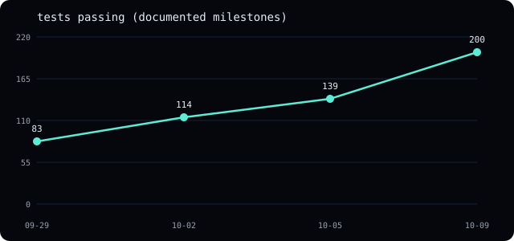
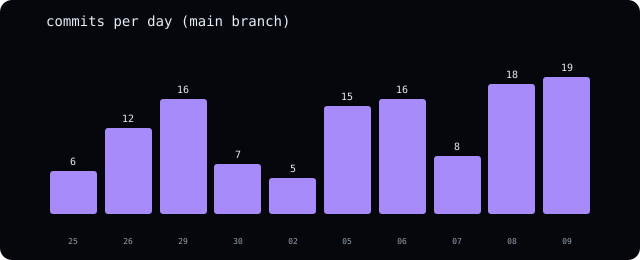
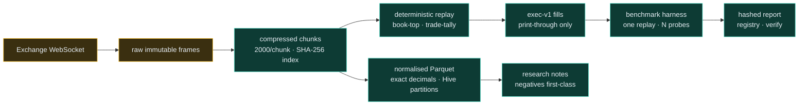
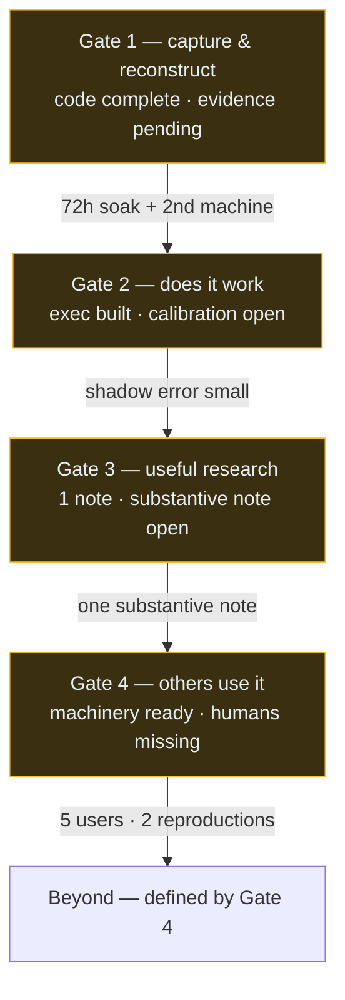

# Project status — 2026-10-10

Where the Astral Project stands, in numbers, diagrams, and gates. Every
figure below is derived from the repository itself (commit messages, file
birth dates, the test suite); sources are stated per figure so nothing here
relies on memory.

## Headline numbers

| Metric | Value | Source |
|---|---|---|
| Tests passing | 200, 0 failing | `cargo test --workspace`, 2026-10-09 |
| Clippy / fmt | zero warnings / clean | same run, `-D warnings` |
| Crates | 8 (record, book, types, normalize, replay, exec, harness, python) | workspace members + birth dates below |
| Spec/runbook docs | 9, all built to the site | `docs/` + `website/build.py` |
| Research notes published | 1 (negative result) | `research/001-*` |
| Commits on main | 100+ across 10 active days | `git log` |
| Live venues verified | Binance + Bybit captures, Coinbase trades/tickers | README verification record |
| Open audit findings | 5 of 13 fully open (+2 post-audit bugs, both fixed) | `docs/audit-2026-10-06.md` follow-ups |

## Growth

Test counts come from commit messages that state them (83 on 09-29, 114 on
10-02, 139 on 10-05, 200 on 10-09) — milestones, not continuous sampling.
The slope is real work, not test inflation: each jump arrived with the
feature it covers (adversarial fixtures, replay events, exec/harness).

Crate births (first commit touching each manifest — the project's actual
assembly order): record + types 09-25, book 09-26, normalize 09-30,
replay 10-02, exec 10-06, harness 10-08, python 10-09.

## System map

## Gate funnel

Each gate has a kill criterion in `ROADMAP.md` (10 bps model error, 3
fruitless months, 6 userless months). The funnel is honest about what blocks
each step: wall-clock evidence and other humans, both unhurriable by commits.

## Audit closure funnel

13 findings entered; closed: overflow guards, soak backoff, manifest trust,
schema gate, book errors, all CLI formats, trade sides, reconstruct gaps,
sequence breaks, used-dir refusal, gap numbers, fuzz coverage — plus 2
post-audit bugs (decimal range, corrupt fills). Open: soak-scale streaming,
behavioral unification leftovers, Bybit snapshots (needs a citable source),
null-row divergence (needs normalized-replay), normalize idempotency is
documented, tail holes are documented. Full table in the audit doc.

## What ends the OSS

Gates 1–3 closed: the soak and second-machine evidence (both need hardware
outside this machine), calibration/shadow measurement (weeks of observation),
the benchmark/registry/SDK loop (built except maturin packaging), and a
substantive research note (needs a data window, e.g. funding carry once
perp streams are reachable). Estimated 2–3 calendar months, ~4–6 weeks of
it active building. The code is the short pole; evidence is the long one.
